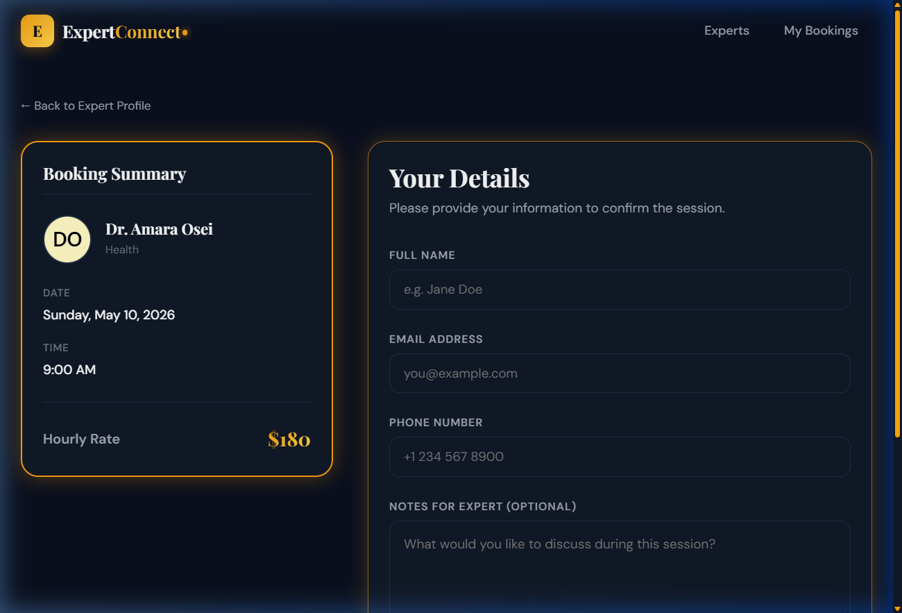
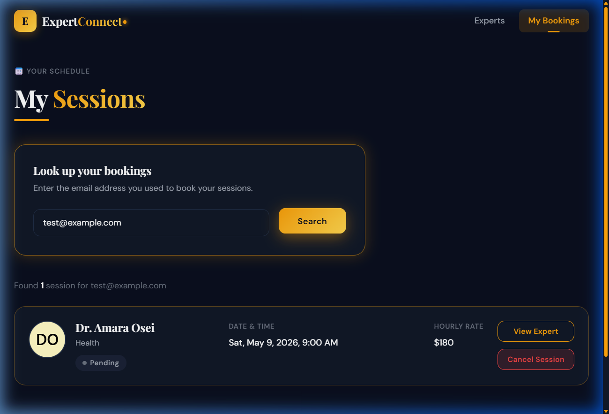

# Expert Connect — Real-Time Booking System

A premium, highly-responsive web application for discovering and booking real-time sessions with domain experts.

## 🚀 Features

- ✅ **Discover Experts:** Browse a diverse list of seeded experts with pagination and category filtering.
- ✅ **View Profiles & Availability:** Check expert credentials, hourly rates, and real-time available time slots over a rolling 7-day window.
- ✅ **Secure Booking Flow:** Submit booking requests with validation on phone, email, and required details.
- ✅ **Double-Booking Prevention:** Atomic MongoDB transactions and a compound unique index guarantee that race conditions cannot result in double-booked slots.
- ✅ **Real-Time Synchronization:** WebSockets via Socket.io instantly push availability updates to all connected clients viewing an expert's profile, eliminating stale data.
- ✅ **Booking Management:** Look up past and upcoming sessions using your email. Cancel pending sessions and automatically free up the slot for others.
- ✅ **Premium UI:** Fully responsive CSS grid layout, dark "luxury" design system, toast notifications, skeleton loaders, and page transitions.

---

## 🛠️ Tech Stack

| Layer | Technologies |
| :--- | :--- |
| **Frontend** | React, Vite, React Router, Socket.io-client |
| **Styling** | Vanilla CSS (CSS Variables, Flexbox/Grid, Animations) |
| **Backend** | Node.js, Express.js, Socket.io |
| **Database** | MongoDB, Mongoose |
| **Validation** | Joi (Backend), Custom Regex (Frontend) |

---

## 🏗️ Architecture & Concurrency Control

### Preventing Race Conditions
Booking systems often suffer from race conditions when two users attempt to book the exact same slot simultaneously. This system prevents double-booking using a two-tiered defence:

1. **Atomic Document Updates (`findOneAndUpdate`)**: When creating a booking, the backend does *not* fetch the expert, modify the array, and save it. Instead, it issues an atomic `$set` command with `arrayFilters`. The database engine itself ensures the slot is updated only if it is currently marked `isBooked: false`.
2. **Database Level Constraint**: The `Booking` collection has a compound unique index on `{ expert: 1, date: 1, timeSlot: 1 }`. Even if the application logic somehow failed, the MongoDB engine would reject the insertion of a duplicate booking with a `11000 Duplicate Key Error`.

### Real-Time Socket Architecture
- **Rooms:** Clients viewing an expert profile join a specific Socket.io room (e.g., `expert_60d5ec...`).
- **Events:** When a slot is booked or cancelled, the backend emits `slotBooked` or `slotFreed` events explicitly to that room.
- **Client Handling:** The frontend intercepts these events and optimises state updates without needing to re-fetch the entire profile payload.

---

## 📖 API Documentation

### Experts
| Method | Path | Description | Query / Params |
| :--- | :--- | :--- | :--- |
| `GET` | `/api/experts` | Fetch paginated experts | `page`, `limit`, `search`, `category` |
| `GET` | `/api/experts/:id` | Get single expert profile | `id` (URL Param) |
| `GET` | `/api/experts/:id/slots` | Get expert available slots | `id` (URL Param) |

### Bookings
| Method | Path | Description | Body / Query |
| :--- | :--- | :--- | :--- |
| `POST` | `/api/bookings` | Create a new booking | `{ expertId, userName, email, phone, date, timeSlot, notes }` |
| `GET` | `/api/bookings` | Lookup user bookings | `email` (Query Param) |
| `PATCH`| `/api/bookings/:id/status` | Update booking status | `{ status: 'cancelled' }` |

---

## 💻 Setup Instructions

### Prerequisites
- Node.js (v16+ recommended)
- MongoDB running locally on port `27017`

### 1. Backend Setup
1. Open a terminal and navigate to the backend directory:
   ```bash
   cd backend
   ```
2. Install dependencies:
   ```bash
   npm install
   ```
3. Set up environment variables:
   Copy `.env.example` to `.env`. Ensure `MONGO_URI` points to your local MongoDB instance.
4. Seed the database with sample experts and slots:
   ```bash
   npm run seed
   ```
5. Start the server:
   ```bash
   npm run dev
   ```
   The backend will run on `http://localhost:5000`.

### 2. Frontend Setup
1. Open a new terminal and navigate to the frontend directory:
   ```bash
   cd frontend
   ```
2. Install dependencies:
   ```bash
   npm install
   ```
3. Set up environment variables:
   Copy `.env.example` to `.env.local` or `.env`.
4. Start the development server:
   ```bash
   npm run dev
   ```
   The frontend will be available at `http://localhost:5173`.

---

## 📸 Snapshots

### 1. Expert Discovery
Browse experts by category or search by name/skill.


### 2. Expert Profile & Availability
View detailed bios and real-time available slots.


### 3. Secure Booking
Instant booking with validation and conflict prevention.


### 4. My Bookings
Manage your schedule and cancel sessions easily.

